# 👋 Hi there, I'm anka 

  
  

  

## 🛠️ Skills & Technologies

  

## 📈 Activity

  

## 🐍 Contributions

<picture>
  <source media="(prefers-color-scheme: dark)" srcset="https://raw.githubusercontent.com/anka-afk/anka-afk/output/github-contribution-grid-snake-dark.svg">
  <source media="(prefers-color-scheme: light)" srcset="https://raw.githubusercontent.com/anka-afk/anka-afk/output/github-contribution-grid-snake.svg">
  
</picture>
